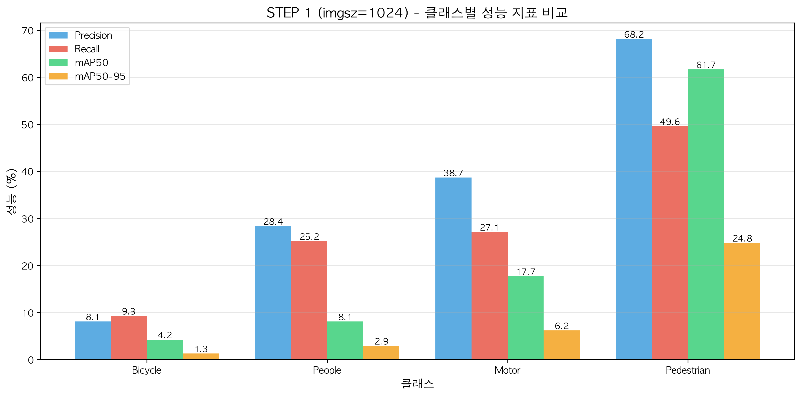
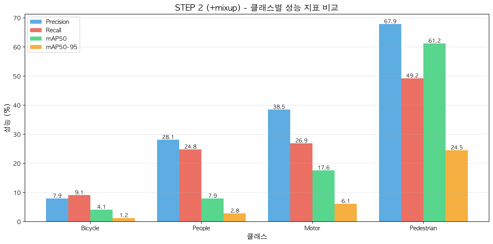
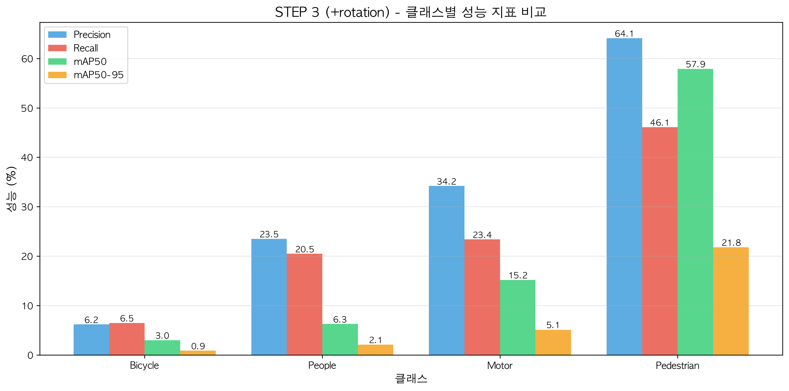
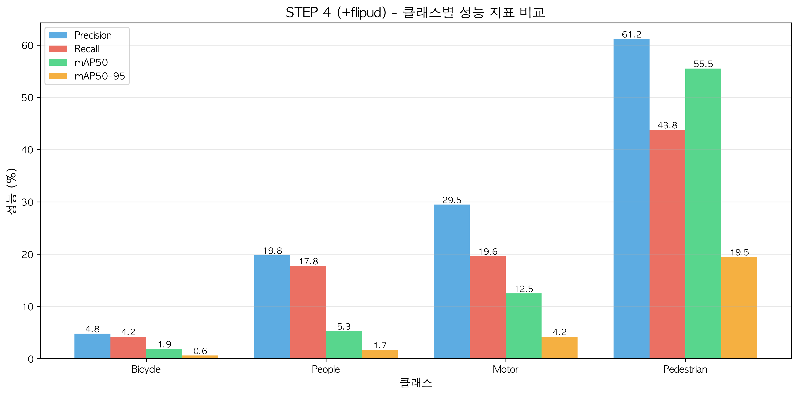
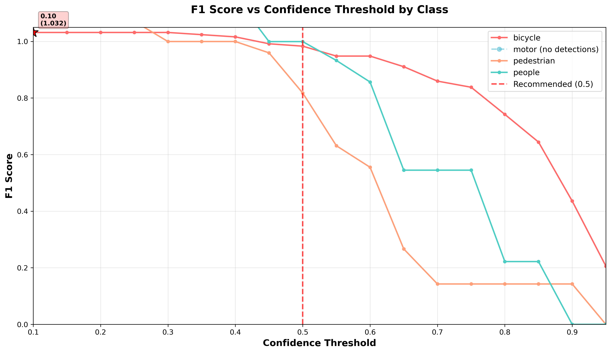

# VisDrone Object Detection & Tracking

## Quick Start

**요구사항**
```bash
pip install ultralytics opencv-python matplotlib numpy pandas
```

**실행**
```bash
export KMP_DUPLICATE_LIB_OK=TRUE
bash run_tracking.sh
```

출력: `tracking_output/tracking.mp4`, `tracking_output/tracking_results.jsonl`

---

## 목표

VisDrone 데이터셋에서 모델이 혼동하기 쉬운 클래스들을 선별하여, **작은 객체 탐지(Small Object Detection)** 성능을 높이고 **유사 클래스 간 오분류(Class Confusion)** 를 줄이는 것을 목표로 한다.

## 타겟 클래스

전체 클래스 중 크기가 작으며 시각적으로 유사하여 모델이 혼동할 가능성이 높은 4개 클래스를 선정한다.

* **Person Group:** pedestrian, people
* **Two-wheeler Group:** bicycle, motor

## 핵심 문제점

#### 작은 객체 크기
드론의 높은 고도로 인해 객체가 매우 작게 촬영된다. 이를 일반적인 크기로 리사이징하여 학습하면, 객체의 형태 정보가 소실되어 모델이 인식하지 못한다.

#### 시각적 모호성
- **pedestrian-people:** 위에서 내려다보는 시점에서 서 있는 사람과 앉아 있는 사람의 구분이 모호함
- **bicycle-motor:** 자전거와 오토바이의 전체적인 구조가 유사하여 구분이 어려움

#### 데이터 불균형


pedestrian 데이터는 풍부한 반면, people이나 bicycle 데이터는 상대적으로 적어 모델이 데이터가 많은 클래스 쪽으로 예측하려는 편향이 발생한다.

---

## 실험 과정

**성능 지표**
- mAP50: IoU 0.5에서의 평균 정밀도
- mAP50-95: IoU 0.5~0.95에서의 평균 정밀도
- Precision: 예측한 객체 중 정답 비율
- Recall: 실제 객체 중 탐지한 비율

#### STEP 0. 베이스라인 (imgsz=640)

**목적:** 현재 데이터셋의 난이도와 문제점을 정량적으로 진단

**결과:** mAP50 = 0.131, mAP50-95 = 0.041

**문제점:**
- Bicycle Recall 2.2% (100개 중 2개만 탐지)
- People Recall 17.0%

<p align="center">
  
  <br><em>STEP 0: 클래스별 성능 지표</em>
</p>

**분석:** 640px 해상도에서 소형 객체는 5~10 픽셀 미만의 점으로 표현되어 CNN의 Convolution 과정에서 정보가 완전히 소실된다.

---

#### STEP 1. 해상도 최적화 (imgsz=1024) ⭐

**가설:** 작은 객체는 픽셀 정보가 부족하므로, 입력 이미지를 키우면 성능이 오를 것이다.

**설정:** imgsz=640 → 1024

**결과:** mAP50 = 0.229 (+74.8%), mAP50-95 = 0.097 (+137%)

<p align="center">
  
  <br><em>STEP 1: 클래스별 성능 지표</em>
</p>

**클래스별 개선율:**

| 클래스 | STEP 0 Recall | STEP 1 Recall | 개선율 |
|--------|---------------|---------------|--------|
| Bicycle | 2.2% | 9.3% | **+214%** |
| People | 17.0% | 25.2% | +125% |
| Motor | 18.1% | 27.1% | +126% |
| Pedestrian | 37.0% | 49.6% | +75% |

**핵심 인사이트:**
- 해상도 증가만으로 모델 성능이 2배 가까이 향상
- 객체가 작을수록 효과가 극대화됨 (Bicycle +214%)
- 픽셀 정보 보존이 성능의 핵심 변수임을 증명

---

#### STEP 2. Mosaic 증강 끄기 (mosaic=0.0)

**가설:** STEP 1에서 default mosaic=1.0이 적용되었는데, 작은 객체에 Mosaic이 오히려 방해가 될 수 있다.

**설정:** STEP 1 + mosaic=0.0

**결과:** mAP50 = 0.225 (-1.7%), mAP50-95 = 0.096 (-1.0%)

<p align="center">
  
  <br><em>STEP 2: 클래스별 성능 지표</em>
</p>

**STEP 1 대비 변화:** mAP50 -1.7%, Recall -3.2%

**실패 원인 분석:**
- Mosaic을 끄면 학습 데이터의 다양성이 감소
- 작은 객체에 Mosaic이 방해가 될 것으로 예상했으나, 실제로는 다양한 배경과 스케일 학습에 도움
- Default mosaic=1.0이 이미 VisDrone에 적합하게 작동 중

**인사이트:** YOLOv8의 default augmentation이 이미 잘 튜닝되어 있으며, 임의로 끄는 것은 오히려 역효과.

---

#### STEP 3. Mixup 증강 (mixup=0.2)

**가설:** 데이터 불균형 해소를 위해 Mixup을 사용하면 소수 클래스 성능이 오를 것이다.

**설정:** STEP 1 + mixup=0.2

**결과:** mAP50 = 0.227 (-0.9%), mAP50-95 = 0.094 (-3.1%)

<p align="center">
  
  <br><em>STEP 3: 클래스별 성능 지표</em>
</p>

**실패 원인 분석:**
- Mixup은 두 이미지를 투명하게 겹치는 방식
- 일반 객체에는 효과적이지만, VisDrone의 객체는 점처럼 작음
- 작은 점 위에 다른 이미지가 겹쳐지자 객체의 특징이 노이즈처럼 희석됨

**인사이트:** 작은 객체에 대해서는 이미지 혼합이 오히려 정보를 희석시켜 역효과를 낸다.

---

#### STEP 4. Rotation 증강 (degrees=15)

**가설:** 드론은 시점이 자유로우므로 Rotation 증강을 주면 일반화 성능이 오를 것이다.

**설정:** STEP 1 + degrees=15.0

**결과:** mAP50 = 0.206 (-10.0%), mAP50-95 = 0.072 (-25.8%)

<p align="center">
  
  <br><em>STEP 4: 클래스별 성능 지표</em>
</p>

**실패 원인 분석:**
- 회전된 객체를 감싸기 위해 Bounding Box가 커지면서 배경이 더 많이 포함되었을 수도 있음
- 이미지 회전 시 Interpolation 과정에서 작은 객체 정보가 왜곡된 것 같음

**인사이트:** 소형 객체 탐지에서는 원본 형태를 보존하는 것이 인위적인 변형보다 중요하다.

---

#### STEP 5. Vertical Flip 증강 (flipud=0.5)

**가설:** Rotation으로 성능 개선을 할수 없었지만, 단순한 상하 반전은 특징을 보존하면서 데이터 다양성을 확보할 수 있을 것이다.

**설정:** STEP 1 + flipud=0.5

**결과:** mAP50 = 0.188 (-17.9%), mAP50-95 = 0.079 (-18.6%)

<p align="center">
  
  <br><em>STEP 5: 클래스별 성능 지표</em>
</p>

**실패 원인 분석:**
- 드론은 항상 위에서 아래를 보는 시점이므로, 상하 반전은 중요하지 않으며 변화를 주지 못한 선택일 것으로 추측됨

**인사이트:** 드론 데이터에서는 좌우 반전은 가능하지만, 상하 반전은 비현실적이어서 성능 저하를 일으킨다.

---

## 전체 실험 결과 요약

| 실험 | 설정 | mAP50 | mAP50-95 | 결과 |
|------|------|-------|----------|------|
| STEP 0 | imgsz=640 | 0.131 | 0.041 | Baseline |
| STEP 1 | imgsz=1024 | **0.229** | **0.097** | ✅ 최적 |
| STEP 2 | mosaic=0.0 | 0.225 | 0.096 | ⚠️ 효과 없음 |
| STEP 3 | +mixup=0.2 | 0.227 | 0.094 | ⚠️ 효과 없음 |
| STEP 4 | +degrees=15 | 0.206 | 0.072 | ❌ 역효과 |
| STEP 5 | +flipud=0.5 | 0.188 | 0.079 | ❌ 역효과 |

---

## 최종 결론

#### 핵심 발견

1. **Resolution is King**
   - 해상도 1024px로의 상향이 가장 효과적 (+74.8%)
   - 작은 객체일수록 해상도 효과가 극대화됨 (Bicycle +214%)

2. **Less is More**
   - Mosaic OFF, Mixup, Rotation, Vertical Flip 등 모든 증강 조정이 실패
   - YOLOv8 default augmentation이 이미 최적
   - 원본 정보를 유지하는 것이 가장 효과적

3. **데이터 불균형 지속**
   - Bicycle (mAP50: 0.042, Recall: 9.3%)
   - People (mAP50: 0.081, Recall: 25.2%)
   - 절대 성능은 여전히 낮아 추가 개선 필요

#### 최종 선택

**STEP 1: imgsz=1024, default augmentation**
- mAP50: 0.229
- 증강 기법 조정 없이 해상도만 증가시킨 상태가 최적

#### 향후 계획

1. 모델 크기 증가 (YOLOv8n → YOLOv8s/m)
2. 학습량 증가 
3. 앵커 박스 최적화 실험

---

## Task B - Object Tracking

#### 목표

Detection 결과를 기반으로 객체 tracking을 수행하고, ID가 부여된 결과를 영상 + JSONL 로그 형태로 출력한다.

#### 접근 방식

**Tracker 선택: BoT-SORT**
- YOLOv8에 내장된 BoT-SORT tracker 사용
- 별도 학습 없이 Detection 결과만으로 추적 가능

**Confidence Threshold 결정:**
- Tracking 결과의 confidence score 분포를 분석하여 최적 threshold 결정
- 분석 결과: median=0.787, mean=0.730
- **최종 threshold: 0.5** (전체 detection의 85.4% 유지)
- 낮은 confidence detection을 필터링하여 ID switch 감소

<p align="center">
  
  <br><em>F1 Score vs Confidence Threshold (클래스별)</em>
</p>

**파이프라인:**
1. VisDrone validation 이미지(548장) → 비디오 변환
2. STEP 1 최적 모델로 Detection + Tracking
3. BoT-SORT로 프레임 간 객체 ID 할당
4. 비디오 + JSONL 형식으로 출력

#### 실행 방법

**자동 실행**
```bash
export KMP_DUPLICATE_LIB_OK=TRUE
bash run_tracking.sh
```

**단계별 실행**

```bash
# 1. 이미지 → 비디오 변환
python create_video.py \
  --input VisDrone2019-DET-val/images \
  --output input_video.avi \
  --fps 30

# 2. 객체 추적
export KMP_DUPLICATE_LIB_OK=TRUE
python track.py \
  --video input_video.avi \
  --model runs/detect/step1_imgsz1024/weights/best.pt \
  --output tracking_output \
  --conf 0.5

# 3. 결과 분석
python analyze_tracking.py \
  --jsonl tracking_output/tracking_results.jsonl

# 4. Confidence 분석
python analyze_confidence.py \
  --jsonl tracking_output/tracking_results.jsonl
```

#### 출력 결과

**tracking.mp4** - 객체 ID가 표시된 영상 (ID:N class score 형식)

**tracking_results.jsonl** - 프레임별 추적 결과
```json
{"frame_idx": 12, "timestamp_ms": 400, "tracks":[
  {"track_id": 3, "cls": "pedestrian", "score": 0.71, "bbox_xyxy":[120,45,190,110]},
  {"track_id": 7, "cls": "bicycle", "score": 0.63, "bbox_xyxy":[33,60,55,98]}
]}
```

#### 한계 및 개선 방향

**현재 문제점**
- 현재 Detection 성능 부족으로 인해 여러 문제(ID Switch 빈번, 클래스 혼동 등) 발생하고 있어 향후 개선 필요함

**향후 개선 방향**
- epochs 증가
- 해상도 추가 상향
- 모델 변경
